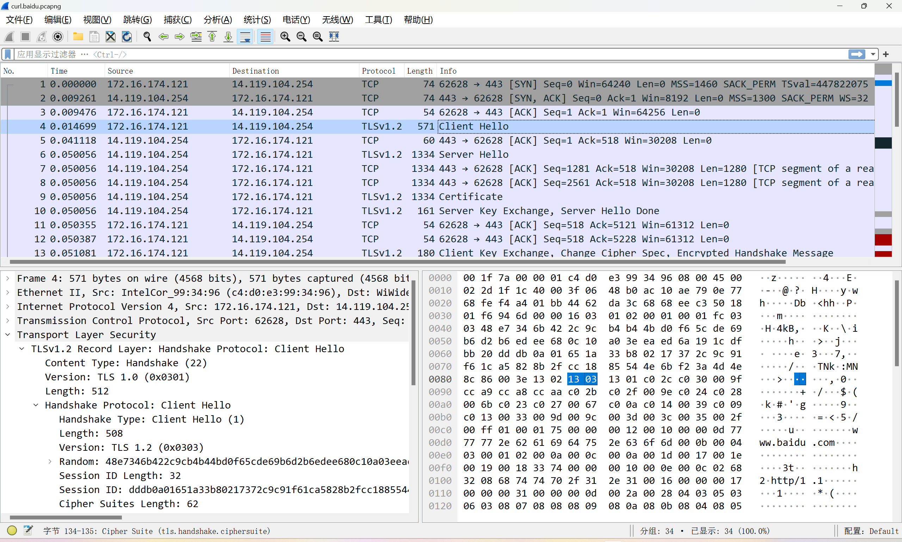

# wireshark
```
ip.addr == 14.119.104.189 or ip.addr == 14.119.104.254
```


# curl test
```
$ curl -v https://www.baidu.com

*   Trying 14.119.104.189:443...
* TCP_NODELAY set
* Connected to www.baidu.com (14.119.104.189) port 443 (#0)
* ALPN, offering h2
* ALPN, offering http/1.1
* successfully set certificate verify locations:
*   CAfile: /etc/ssl/certs/ca-certificates.crt
  CApath: /etc/ssl/certs
* TLSv1.3 (OUT), TLS handshake, Client hello (1):
* TLSv1.3 (IN), TLS handshake, Server hello (2):
* TLSv1.2 (IN), TLS handshake, Certificate (11):
* TLSv1.2 (IN), TLS handshake, Server key exchange (12):
* TLSv1.2 (IN), TLS handshake, Server finished (14):
* TLSv1.2 (OUT), TLS handshake, Client key exchange (16):
* TLSv1.2 (OUT), TLS change cipher, Change cipher spec (1):
* TLSv1.2 (OUT), TLS handshake, Finished (20):
* TLSv1.2 (IN), TLS handshake, Finished (20):
* SSL connection using TLSv1.2 / ECDHE-RSA-AES128-GCM-SHA256
* ALPN, server accepted to use http/1.1
* Server certificate:
*  subject: C=CN; ST=beijing; L=beijing; O=Beijing Baidu Netcom Science Technology Co., Ltd; CN=baidu.com
*  start date: Jul  6 01:51:06 2023 GMT
*  expire date: Aug  6 01:51:05 2024 GMT
*  subjectAltName: host "www.baidu.com" matched cert's "*.baidu.com"
*  issuer: C=BE; O=GlobalSign nv-sa; CN=GlobalSign RSA OV SSL CA 2018
*  SSL certificate verify ok.
> GET / HTTP/1.1
> Host: www.baidu.com
> User-Agent: curl/7.68.0
> Accept: */*
>
* Mark bundle as not supporting multiuse
< HTTP/1.1 200 OK
< Accept-Ranges: bytes
< Cache-Control: private, no-cache, no-store, proxy-revalidate, no-transform
< Connection: keep-alive
< Content-Length: 2443
< Content-Type: text/html
< Date: Wed, 16 Aug 2023 12:32:53 GMT
< Etag: "58860402-98b"
< Last-Modified: Mon, 23 Jan 2017 13:24:18 GMT
< Pragma: no-cache
< Server: bfe/1.0.8.18
< Set-Cookie: BDORZ=27315; max-age=86400; domain=.baidu.com; path=/
<
<!DOCTYPE html>
<!--STATUS OK--><html> <head><meta http-equiv=content-type content=text/html;charset=utf-8><meta http-equiv=X-UA-Compatible content=IE=Edge><meta content=always name=referrer><link rel=stylesheet type=text/css href=https://ss1.bdstatic.com/5eN1bjq8AAUYm2zgoY3K/r/www/cache/bdorz/baidu.min.css><title>百度一下，你就知道</title></head> <body link=#0000cc> <div id=wrapper> <div id=head> <div class=head_wrapper> <div class=s_form> <div class=s_form_wrapper> <div id=lg>  </div> <form id=form name=f action=//www.baidu.com/s class=fm> <input type=hidden name=bdorz_come value=1> <input type=hidden name=ie value=utf-8> <input type=hidden name=f value=8> <input type=hidden name=rsv_bp value=1> <input type=hidden name=rsv_idx value=1> <input type=hidden name=tn value=baidu><span class="bg s_ipt_wr"><input id=kw name=wd class=s_ipt value maxlength=255 autocomplete=off autofocus=autofocus></span><span class="bg s_btn_wr"><input type=submit id=su value=百度一下 class="bg s_btn" autofocus></span> </form> </div> </div> <div id=u1> <a href=http://news.baidu.com name=tj_trnews class=mnav>新闻</a> <a href=https://www.hao123.com name=tj_trhao123 class=mnav>hao123</a> <a href=http://map.baidu.com name=tj_trmap class=mnav>地图</a> <a href=http://v.baidu.com name=tj_trvideo class=mnav>视频</a> <a href=http://tieba.baidu.com name=tj_trtieba class=mnav>贴吧</a> <noscript> <a href=http://www.baidu.com/bdorz/login.gif?login&amp;tpl=mn&amp;u=http%3A%2F%2Fwww.baidu.com%2f%3fbdorz_come%3d1 name=tj_login class=lb>登录</a> </noscript> <script>document.write('<a href="http://www.baidu.com/bdorz/login.gif?login&tpl=mn&u='+ encodeURIComponent(window.location.href+ (window.location.search === "" ? "?" : "&")+ "bdorz_come=1")+ '" name="tj_login" class="lb">登录</a>');
                </script> <a href=//www.baidu.com/more/ name=tj_briicon class=bri style="display: block;">更多产品</a> </div> </div> </div> <div id=ftCon> <div id=ftConw> <p id=lh> <a href=http://home.baidu.com>关于百度</a> <a href=http://ir.baidu.com>About Baidu</a> </p> <p id=cp>&copy;2017&nbsp;Baidu&nbsp;<a href=http://www.baidu.com/duty/>使用百度前必读</a>&nbsp; <a href=http://jianyi.baidu.com/ class=cp-feedback>意见反馈</a>&nbsp;京ICP证030173号&nbsp;  </p> </div> </div> </div> </body> </html>
* Connection #0 to host www.baidu.com left intact
```

## Handshake Protocol: Client Hello
```
Handshake Protocol: Client Hello
    Handshake Type: Client Hello (1)
    Length: 508
    Version: TLS 1.2 (0x0303)
    Random: 48e7346b422c9cb4b44bd0f65cde69b6d2b6edee680c10a03eeaed6a191cdfbb
    Session ID Length: 32
    Session ID: dddb0a01651a33b80217372c9c91f61ca5828b2fcc1885544e6bf23a4d4e8c86
    Cipher Suites Length: 62
    Cipher Suites (31 suites)
    Compression Methods Length: 1
    Compression Methods (1 method)
```

## Handshake Protocol: Server Hello
```
Handshake Protocol: Server Hello
    Handshake Type: Server Hello (2)
    Length: 98
    Version: TLS 1.2 (0x0303)
    Random: 64dcc576a7b6f4ccbb101a58c6552d528bdd9a35b38e839ef9e62582cce1ffe6
    Session ID Length: 32
    Session ID: 88a1d4294db34088d86ddd9866e763ca20ad6377954b0f45169601e67ea57726
    Cipher Suite: TLS_ECDHE_RSA_WITH_AES_128_GCM_SHA256 (0xc02f)
    Compression Method: null (0)
```

## Handshake Protocol: Certificate
```
Handshake Protocol: Certificate
    Handshake Type: Certificate (11)
    Length: 4764
    Certificates Length: 4761
    Certificates (4761 bytes)
```

## Handshake Protocol: Server Key Exchange
``` 
Handshake Protocol: Server Key Exchange
    Handshake Type: Server Key Exchange (12)
    Length: 329
    EC Diffie-Hellman Server Params
```

## Handshake Protocol: Server Hello Done
```
Handshake Protocol: Server Hello Done
    Handshake Type: Server Hello Done (14)
    Length: 0
```

## Handshake Protocol: Client Key Exchange, Change Cipher Spec, Encrypted Handshake Message
```
TLSv1.2 Record Layer: Handshake Protocol: Client Key Exchange
    Content Type: Handshake (22)
    Version: TLS 1.2 (0x0303)
    Length: 70
    Handshake Protocol: Client Key Exchange
        Handshake Type: Client Key Exchange (16)
        Length: 66
        EC Diffie-Hellman Client Params
TLSv1.2 Record Layer: Change Cipher Spec Protocol: Change Cipher Spec
    Content Type: Change Cipher Spec (20)
    Version: TLS 1.2 (0x0303)
    Length: 1
    Change Cipher Spec Message
TLSv1.2 Record Layer: Handshake Protocol: Encrypted Handshake Message
    Content Type: Handshake (22)
    Version: TLS 1.2 (0x0303)
    Length: 40
    Handshake Protocol: Encrypted Handshake Message
```

## Change Cipher Spec, Encrypted Handshake Message
```
TLSv1.2 Record Layer: Change Cipher Spec Protocol: Change Cipher Spec
    Content Type: Change Cipher Spec (20)
    Version: TLS 1.2 (0x0303)
    Length: 1
    Change Cipher Spec Message
TLSv1.2 Record Layer: Handshake Protocol: Encrypted Handshake Message
    Content Type: Handshake (22)
    Version: TLS 1.2 (0x0303)
    Length: 40
    Handshake Protocol: Encrypted Handshake Message
```

## Application Data Protocol: Hypertext Transfer Protocol
```
TLSv1.2 Record Layer: Application Data Protocol: Hypertext Transfer Protocol
    Content Type: Application Data (23)
    Version: TLS 1.2 (0x0303)
    Length: 101
    Encrypted Application Data: 5ad362cdf4e5bae49d42b649c2956cbeca791e676863f5513909c08534af77916c821d2f…
    [Application Data Protocol: Hypertext Transfer Protocol]
```